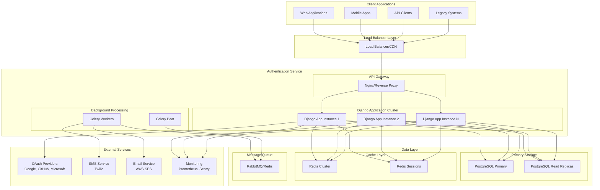
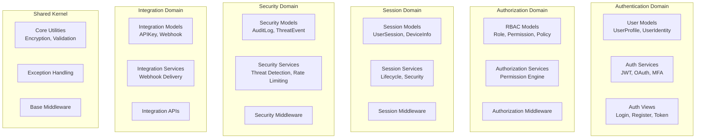

# Enterprise-Grade Authentication Backend - Design Document

## Overview

This design document outlines the architecture for a comprehensive, enterprise-grade authentication backend built with Django. The system serves as a centralized authentication hub capable of handling millions of users with sub-100ms response times, supporting OAuth2/OpenID Connect, multi-factor authentication, advanced session management, and seamless integration with external systems.

The architecture follows Domain-Driven Design (DDD) principles within a monolithic Django application, emphasizing security-first design, horizontal scalability, and vendor-agnostic integration patterns.

## Architecture

### High-Level System Architecture



### Domain Architecture

The system is organized into distinct domains following DDD principles:



## Components and Interfaces

### Core Authentication Components

#### 1. User Management System

**UserProfile Model:**

- Extended Django AbstractUser with enterprise fields
- Support for multiple authentication methods
- Comprehensive audit trails
- Organization and department associations

**UserIdentity Model:**

- Links users to external OAuth providers
- Stores provider-specific metadata
- Manages token refresh cycles
- Prevents account takeover attacks

**Key Interfaces:**

```python
class IUserManager:
    def create_user_with_verification(email, password, **kwargs) -> UserProfile
    def link_social_account(user, provider, provider_data) -> UserIdentity
    def verify_email(user, token) -> bool
    def enforce_password_policy(password) -> ValidationResult

class IIdentityProvider:
    async def get_authorization_url(state, scopes) -> str
    async def exchange_code_for_token(code, state) -> TokenData
    async def get_user_info(access_token) -> UserData
    async def refresh_access_token(refresh_token) -> TokenData
```

#### 2. JWT Token Management

**Token Architecture:**

- Access tokens: 15-minute expiration, RS256 signing
- Refresh tokens: 30-day expiration with rotation
- Device binding through fingerprinting
- Distributed token blacklist with Redis

**Key Components:**

```python
class JWTService:
    def generate_token_pair(user, device_info, scopes) -> TokenPair
    def validate_access_token(token) -> TokenClaims
    def refresh_token_pair(refresh_token) -> TokenPair
    def revoke_token(token_id) -> bool
    def introspect_token(token) -> TokenInfo

class TokenBlacklistService:
    def blacklist_token(token_id, expires_at) -> bool
    def is_token_blacklisted(token_id) -> bool
    def cleanup_expired_tokens() -> int
```

#### 3. OAuth2/OpenID Connect Integration

**Provider Abstraction:**

- Unified interface for all OAuth providers
- Dynamic provider configuration
- Automatic user data normalization
- Token refresh management

**Supported Providers:**

- Google OAuth 2.0 / OpenID Connect
- GitHub OAuth 2.0
- Microsoft Azure AD / Office 365
- Apple Sign In
- LinkedIn OAuth 2.0
- Custom OAuth 2.0 providers

**Provider Registry:**

```python
class OAuthProviderRegistry:
    def register_provider(name, provider_class, config) -> None
    def get_provider(name) -> IOAuthProvider
    def list_available_providers() -> List[ProviderInfo]
    def configure_provider(name, config) -> bool

class IOAuthProvider:
    async def get_authorization_url(state, scopes) -> str
    async def exchange_code_for_token(code, state) -> TokenData
    async def get_user_info(access_token) -> NormalizedUserData
    async def refresh_access_token(refresh_token) -> TokenData
```

#### 4. Multi-Factor Authentication System

**MFA Components:**

- TOTP (Time-based One-Time Passwords) with QR codes
- SMS verification via Twilio integration
- Email-based verification codes
- Backup codes for recovery
- Hardware security key support (future)

**MFA Service Architecture:**

```python
class MFAService:
    def setup_totp(user) -> TOTPSetupData
    def verify_totp(user, token) -> bool
    def send_sms_code(user) -> bool
    def verify_sms_code(user, code) -> bool
    def generate_backup_codes(user) -> List[str]
    def verify_backup_code(user, code) -> bool

class MFADevice(models.Model):
    user = ForeignKey(UserProfile)
    device_type = CharField(choices=MFA_DEVICE_TYPES)
    secret_key = TextField()  # Encrypted
    is_confirmed = BooleanField()
    backup_codes = JSONField()  # Encrypted
    last_used = DateTimeField()
```

### Session Management Components

#### Advanced Session Architecture

**Session Models:**

```python
class UserSession(models.Model):
    user = ForeignKey(UserProfile)
    session_id = CharField(unique=True)
    device_fingerprint = CharField()
    ip_address = GenericIPAddressField()
    user_agent = TextField()
    device_type = CharField()
    browser = CharField()
    operating_system = CharField()
    country = CharField()
    city = CharField()
    status = CharField(choices=SESSION_STATUS_CHOICES)
    risk_score = FloatField()
    is_trusted_device = BooleanField()
    created_at = DateTimeField()
    last_activity = DateTimeField()
    expires_at = DateTimeField()
```

**Session Service:**

```python
class SessionService:
    async def create_session(user, request, login_method) -> UserSession
    async def validate_session(session_id) -> SessionValidationResult
    async def update_session_activity(session_id) -> bool
    async def terminate_session(session_id) -> bool
    async def get_user_sessions(user) -> List[UserSession]
    async def enforce_concurrent_session_limits(user) -> None
```

### Security and Threat Detection

#### Threat Detection Engine

**Components:**

- Real-time behavioral analysis
- IP reputation checking
- Geographic anomaly detection
- Velocity-based rate limiting
- Machine learning anomaly detection

**Threat Detection Service:**

```python
class ThreatDetectionService:
    async def analyze_login_attempt(user, request_data) -> ThreatAnalysis
    async def calculate_risk_score(user, context) -> float
    async def detect_brute_force_attack(ip_address) -> bool
    async def analyze_behavioral_patterns(user, activity) -> AnomalyScore
    async def trigger_security_response(user, threat_level) -> None

class SecurityEvent(models.Model):
    event_type = CharField(choices=EVENT_TYPES)
    severity = CharField(choices=SEVERITY_LEVELS)
    user = ForeignKey(UserProfile, null=True)
    ip_address = GenericIPAddressField()
    risk_score = FloatField()
    threat_indicators = JSONField()
    response_taken = BooleanField()
    timestamp = DateTimeField()
```

#### Rate Limiting and Abuse Prevention

**Multi-Level Rate Limiting:**

- Per-IP rate limiting
- Per-user rate limiting
- Per-endpoint rate limiting
- Per-application rate limiting

**Rate Limiting Service:**

```python
class RateLimitingService:
    def check_rate_limit(key, limit, window) -> RateLimitResult
    def increment_counter(key, window) -> int
    def get_remaining_attempts(key, limit, window) -> int
    def reset_rate_limit(key) -> bool
    def configure_progressive_delays(attempts) -> timedelta
```

### Authorization System

#### Role-Based Access Control (RBAC)

**RBAC Models:**

```python
class Role(models.Model):
    name = CharField(unique=True)
    description = TextField()
    parent_role = ForeignKey('self', null=True)
    is_system_role = BooleanField()
    permissions = ManyToManyField('Permission')

class Permission(models.Model):
    name = CharField(unique=True)
    resource_type = CharField(choices=RESOURCE_TYPES)
    action = CharField(choices=ACTION_TYPES)
    conditions = JSONField()

class UserRole(models.Model):
    user = ForeignKey(UserProfile)
    role = ForeignKey(Role)
    granted_by = ForeignKey(UserProfile)
    granted_at = DateTimeField()
    expires_at = DateTimeField(null=True)
```

**Authorization Engine:**

```python
class AuthorizationEngine:
    def check_permission(user, resource, action, context) -> bool
    def get_user_permissions(user) -> Set[Permission]
    def evaluate_conditions(permission, context) -> bool
    def get_effective_roles(user) -> List[Role]
    def audit_authorization_decision(user, resource, action, result) -> None
```

### Integration and API Components

#### RESTful API Architecture

**API Design Principles:**

- RESTful endpoints with proper HTTP methods
- OpenAPI 3.0 specification
- Consistent error handling
- Comprehensive input validation
- Rate limiting and throttling
- API versioning support

**Key API Endpoints:**

```
Authentication APIs:
POST /api/v1/auth/login
POST /api/v1/auth/register
POST /api/v1/auth/logout
POST /api/v1/auth/refresh
GET  /api/v1/auth/me

OAuth APIs:
GET  /api/v1/oauth/providers
GET  /api/v1/oauth/{provider}/authorize
POST /api/v1/oauth/{provider}/callback
POST /api/v1/oauth/{provider}/link
DELETE /api/v1/oauth/{provider}/unlink

MFA APIs:
POST /api/v1/mfa/setup/totp
POST /api/v1/mfa/verify/totp
POST /api/v1/mfa/setup/sms
POST /api/v1/mfa/verify/sms
GET  /api/v1/mfa/backup-codes

Session Management APIs:
GET  /api/v1/sessions
DELETE /api/v1/sessions/{session_id}
POST /api/v1/sessions/terminate-all

User Management APIs:
GET  /api/v1/users/profile
PUT  /api/v1/users/profile
POST /api/v1/users/change-password
POST /api/v1/users/verify-email

Admin APIs:
GET  /api/v1/admin/users
POST /api/v1/admin/users/{user_id}/lock
GET  /api/v1/admin/audit-logs
GET  /api/v1/admin/security-events
```

#### Webhook System

**Webhook Architecture:**

- Event-driven notifications
- Reliable delivery with retries
- Signature verification
- Dead letter queues
- Delivery status tracking

**Webhook Service:**

```python
class WebhookService:
    async def register_webhook(organization, config) -> WebhookEndpoint
    async def deliver_webhook(event_type, data, user) -> List[DeliveryTask]
    async def verify_webhook_signature(payload, signature, secret) -> bool
    async def retry_failed_delivery(delivery_id) -> bool
    async def get_delivery_status(delivery_id) -> DeliveryStatus

class WebhookEndpoint(models.Model):
    organization = ForeignKey('Organization')
    url = URLField()
    events = JSONField()  # List of subscribed events
    secret_key = CharField()
    is_active = BooleanField()
    headers = JSONField()
    timeout = IntegerField()
```

## Data Models

### Core Database Schema

#### User and Identity Tables

```sql
-- Core user profile table
CREATE TABLE users_userprofile (
    id UUID PRIMARY KEY DEFAULT gen_random_uuid(),
    email VARCHAR(254) UNIQUE NOT NULL,
    first_name VARCHAR(150),
    last_name VARCHAR(150),
    phone_number VARCHAR(20),
    is_email_verified BOOLEAN DEFAULT FALSE,
    is_phone_verified BOOLEAN DEFAULT FALSE,
    account_locked_until TIMESTAMP,
    failed_login_attempts INTEGER DEFAULT 0,
    organization VARCHAR(255),
    department VARCHAR(255),
    employee_id VARCHAR(100),
    last_password_change TIMESTAMP DEFAULT NOW(),
    created_at TIMESTAMP DEFAULT NOW(),
    updated_at TIMESTAMP DEFAULT NOW()
);

-- External identity provider linkage
CREATE TABLE users_useridentity (
    id UUID PRIMARY KEY DEFAULT gen_random_uuid(),
    user_id UUID REFERENCES users_userprofile(id) ON DELETE CASCADE,
    provider VARCHAR(50) NOT NULL,
    provider_user_id VARCHAR(255) NOT NULL,
    provider_username VARCHAR(255),
    provider_email VARCHAR(254),
    provider_data JSONB DEFAULT '{}',
    access_token TEXT,  -- Encrypted
    refresh_token TEXT, -- Encrypted
    token_expires_at TIMESTAMP,
    linked_at TIMESTAMP DEFAULT NOW(),
    last_used TIMESTAMP DEFAULT NOW(),
    is_primary BOOLEAN DEFAULT FALSE,
    UNIQUE(provider, provider_user_id)
);

-- Indexes for performance
CREATE INDEX idx_users_userprofile_email ON users_userprofile(email);
CREATE INDEX idx_users_useridentity_user_provider ON users_useridentity(user_id, provider);
CREATE INDEX idx_users_useridentity_provider_user_id ON users_useridentity(provider, provider_user_id);
```

#### Session and Token Tables

```sql
-- Advanced session management
CREATE TABLE sessions_usersession (
    id UUID PRIMARY KEY DEFAULT gen_random_uuid(),
    user_id UUID REFERENCES users_userprofile(id) ON DELETE CASCADE,
    session_id VARCHAR(255) UNIQUE NOT NULL,
    device_fingerprint VARCHAR(255),
    user_agent TEXT,
    ip_address INET,
    device_type VARCHAR(50),
    browser VARCHAR(100),
    operating_system VARCHAR(100),
    country VARCHAR(100),
    city VARCHAR(100),
    status VARCHAR(20) DEFAULT 'active',
    risk_score FLOAT DEFAULT 0.0,
    is_trusted_device BOOLEAN DEFAULT FALSE,
    login_method VARCHAR(50),
    created_at TIMESTAMP DEFAULT NOW(),
    last_activity TIMESTAMP DEFAULT NOW(),
    expires_at TIMESTAMP NOT NULL
);

-- JWT token blacklist
CREATE TABLE auth_tokenblacklist (
    id UUID PRIMARY KEY DEFAULT gen_random_uuid(),
    token_id VARCHAR(255) UNIQUE NOT NULL,
    user_id UUID REFERENCES users_userprofile(id) ON DELETE CASCADE,
    blacklisted_at TIMESTAMP DEFAULT NOW(),
    expires_at TIMESTAMP NOT NULL
);

-- Refresh token tracking
CREATE TABLE auth_refreshtoken (
    id UUID PRIMARY KEY DEFAULT gen_random_uuid(),
    user_id UUID REFERENCES users_userprofile(id) ON DELETE CASCADE,
    token_id VARCHAR(255) UNIQUE NOT NULL,
    device_id VARCHAR(255),
    created_at TIMESTAMP DEFAULT NOW(),
    expires_at TIMESTAMP NOT NULL,
    is_revoked BOOLEAN DEFAULT FALSE
);

-- Session indexes
CREATE INDEX idx_sessions_user_status ON sessions_usersession(user_id, status);
CREATE INDEX idx_sessions_device_fingerprint ON sessions_usersession(device_fingerprint);
CREATE INDEX idx_sessions_ip_created ON sessions_usersession(ip_address, created_at);
```

#### Security and Audit Tables

```sql
-- Comprehensive security event logging
CREATE TABLE security_securityevent (
    id UUID PRIMARY KEY DEFAULT gen_random_uuid(),
    event_type VARCHAR(50) NOT NULL,
    severity VARCHAR(20) DEFAULT 'low',
    user_id UUID REFERENCES users_userprofile(id) ON DELETE SET NULL,
    session_id VARCHAR(255),
    ip_address INET,
    user_agent TEXT,
    request_id VARCHAR(255),
    description TEXT,
    event_data JSONB DEFAULT '{}',
    risk_score FLOAT DEFAULT 0.0,
    threat_indicators JSONB DEFAULT '[]',
    response_taken BOOLEAN DEFAULT FALSE,
    response_details JSONB DEFAULT '{}',
    timestamp TIMESTAMP DEFAULT NOW()
);

-- MFA device management
CREATE TABLE auth_mfadevice (
    id UUID PRIMARY KEY DEFAULT gen_random_uuid(),
    user_id UUID REFERENCES users_userprofile(id) ON DELETE CASCADE,
    device_type VARCHAR(20) NOT NULL,
    secret_key TEXT,  -- Encrypted
    backup_codes JSONB,  -- Encrypted
    is_confirmed BOOLEAN DEFAULT FALSE,
    is_active BOOLEAN DEFAULT TRUE,
    last_used TIMESTAMP,
    created_at TIMESTAMP DEFAULT NOW()
);

-- Security event indexes
CREATE INDEX idx_security_user_event_time ON security_securityevent(user_id, event_type, timestamp);
CREATE INDEX idx_security_ip_time ON security_securityevent(ip_address, timestamp);
CREATE INDEX idx_security_severity_time ON security_securityevent(severity, timestamp);
CREATE INDEX idx_security_risk_score ON security_securityevent(risk_score);
```

#### RBAC Tables

```sql
-- Role-based access control
CREATE TABLE auth_role (
    id UUID PRIMARY KEY DEFAULT gen_random_uuid(),
    name VARCHAR(100) UNIQUE NOT NULL,
    description TEXT,
    parent_role_id UUID REFERENCES auth_role(id) ON DELETE SET NULL,
    is_system_role BOOLEAN DEFAULT FALSE,
    is_active BOOLEAN DEFAULT TRUE,
    created_at TIMESTAMP DEFAULT NOW(),
    created_by_id UUID REFERENCES users_userprofile(id) ON DELETE SET NULL
);

CREATE TABLE auth_permission (
    id UUID PRIMARY KEY DEFAULT gen_random_uuid(),
    name VARCHAR(100) UNIQUE NOT NULL,
    resource_type VARCHAR(50) NOT NULL,
    action VARCHAR(50) NOT NULL,
    description TEXT,
    conditions JSONB DEFAULT '{}'
);

CREATE TABLE auth_role_permissions (
    id UUID PRIMARY KEY DEFAULT gen_random_uuid(),
    role_id UUID REFERENCES auth_role(id) ON DELETE CASCADE,
    permission_id UUID REFERENCES auth_permission(id) ON DELETE CASCADE,
    UNIQUE(role_id, permission_id)
);

CREATE TABLE auth_userrole (
    id UUID PRIMARY KEY DEFAULT gen_random_uuid(),
    user_id UUID REFERENCES users_userprofile(id) ON DELETE CASCADE,
    role_id UUID REFERENCES auth_role(id) ON DELETE CASCADE,
    granted_by_id UUID REFERENCES users_userprofile(id) ON DELETE SET NULL,
    granted_at TIMESTAMP DEFAULT NOW(),
    expires_at TIMESTAMP,
    is_active BOOLEAN DEFAULT TRUE
);
```

## Error Handling

### Exception Hierarchy

```python
class AuthenticationError(Exception):
    """Base authentication exception"""
    pass

class InvalidCredentialsError(AuthenticationError):
    """Invalid username/password combination"""
    pass

class AccountLockedError(AuthenticationError):
    """Account is temporarily locked"""
    pass

class MFARequiredError(AuthenticationError):
    """Multi-factor authentication required"""
    pass

class TokenExpiredError(AuthenticationError):
    """JWT token has expired"""
    pass

class TokenInvalidError(AuthenticationError):
    """JWT token is invalid or malformed"""
    pass

class RateLimitExceededError(AuthenticationError):
    """Rate limit exceeded for this operation"""
    pass

class AuthorizationError(Exception):
    """Base authorization exception"""
    pass

class InsufficientPermissionsError(AuthorizationError):
    """User lacks required permissions"""
    pass

class ResourceNotFoundError(AuthorizationError):
    """Requested resource not found"""
    pass
```

### Error Response Format

```json
{
  "error": {
    "code": "INVALID_CREDENTIALS",
    "message": "Invalid email or password",
    "details": {
      "field": "password",
      "reason": "incorrect_password"
    },
    "request_id": "req_123456789",
    "timestamp": "2024-01-15T10:30:00Z"
  }
}
```

## Testing Strategy

### Testing Pyramid

#### Unit Tests (70%)

- Model validation and business logic
- Service layer functionality
- Utility functions and helpers
- Custom middleware components
- Authentication and authorization logic

#### Integration Tests (20%)

- API endpoint testing
- Database integration
- External service integration (OAuth providers, SMS, Email)
- Cache layer integration
- Message queue integration

#### End-to-End Tests (10%)

- Complete authentication flows
- Multi-factor authentication workflows
- Session management scenarios
- Security threat detection
- Performance and load testing

### Test Coverage Requirements

- Minimum 90% code coverage
- 100% coverage for security-critical components
- Performance benchmarks for all API endpoints
- Security penetration testing
- Load testing for scalability validation

### Testing Tools and Frameworks

```python
# Testing dependencies
pytest==7.4.0
pytest-django==4.5.2
pytest-asyncio==0.21.0
pytest-cov==4.1.0
factory-boy==3.3.0
freezegun==1.2.2
responses==0.23.1
pytest-mock==3.11.1

# Performance testing
locust==2.15.1
pytest-benchmark==4.0.0

# Security testing
bandit==1.7.5
safety==2.3.4
```

### Continuous Integration Pipeline

```yaml
# .github/workflows/ci.yml
name: CI Pipeline

on: [push, pull_request]

jobs:
  test:
    runs-on: ubuntu-latest
    services:
      postgres:
        image: postgres:15
        env:
          POSTGRES_PASSWORD: postgres
        options: >-
          --health-cmd pg_isready
          --health-interval 10s
          --health-timeout 5s
          --health-retries 5
      redis:
        image: redis:7
        options: >-
          --health-cmd "redis-cli ping"
          --health-interval 10s
          --health-timeout 5s
          --health-retries 5

    steps:
      - uses: actions/checkout@v3
      - name: Set up Python
        uses: actions/setup-python@v4
        with:
          python-version: "3.11"

      - name: Install dependencies
        run: |
          pip install -r requirements/test.txt

      - name: Run security checks
        run: |
          bandit -r apps/
          safety check

      - name: Run tests
        run: |
          pytest --cov=apps --cov-report=xml --cov-fail-under=90

      - name: Run performance tests
        run: |
          pytest tests/performance/ --benchmark-only

      - name: Upload coverage
        uses: codecov/codecov-action@v3
```

This comprehensive design document provides the foundation for building an enterprise-grade authentication backend that meets all the requirements outlined in the requirements document. The architecture is designed for scalability, security, and maintainability while providing the flexibility needed for integration with various client applications and external systems.
